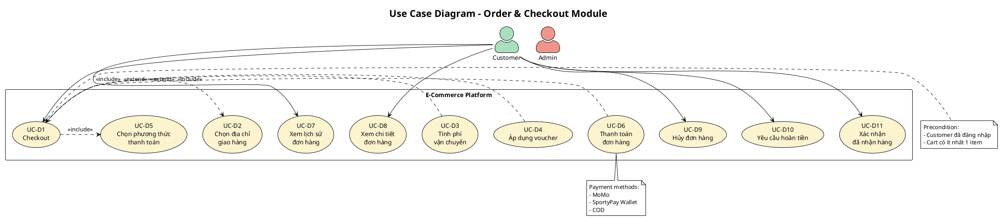
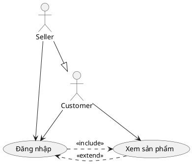

# HƯỚNG DẪN VẼ SƠ ĐỒ USE CASE TỔNG QUAN - HỆ THỐNG E-COMMERCE PBL6

## 📋 TỔNG QUAN DỰ ÁN

**Tên dự án:** E-Commerce Platform PBL6  
**Mô tả:** Hệ thống thương mại điện tử đa vai trò với tích hợp thanh toán, vận chuyển, chat real-time và AI chatbot  
**Công nghệ:** Spring Boot + React + React Native + MySQL + WebSocket + AI

---

## 👥 DANH SÁCH ACTORS

### 1. **Guest (Khách vãng lai)** 👤
- Người dùng chưa đăng nhập
- Quyền hạn: Xem sản phẩm, tìm kiếm, xem shop

### 2. **Customer (Khách hàng)** 🛒
- Người dùng đã đăng ký và đăng nhập
- Kế thừa: Guest
- Quyền hạn: Mua hàng, chat, đánh giá, quản lý đơn hàng

### 3. **Seller (Người bán)** 🏪
- Chủ shop đã đăng ký
- Kế thừa: Customer  
- Quyền hạn: Quản lý shop, sản phẩm, đơn hàng, voucher

### 4. **Admin (Quản trị viên)** 👨‍💼
- Người quản lý nền tảng
- Quyền hạn: Quản lý toàn bộ hệ thống

### 5. **External Systems (Hệ thống bên ngoài)** ⚙️
- GHN API (Vận chuyển)
- MoMo/SportyPay (Thanh toán)
- Cohere AI (Chatbot)
- Cloudinary (Upload ảnh)

---

## 🎯 DANH SÁCH USE CASES THEO MODULE

### A. AUTHENTICATION & AUTHORIZATION (Xác thực)

| ID | Use Case | Actor | Mô tả |
|---|---|---|---|
| UC-A1 | Đăng ký tài khoản | Guest | Register với email/password |
| UC-A2 | Đăng nhập | Guest | Login bằng email hoặc social |
| UC-A3 | Đăng nhập Google/Facebook | Guest | OAuth 2.0 authentication |
| UC-A4 | Quên mật khẩu | Guest | Reset password qua email |
| UC-A5 | Đăng xuất | Customer/Seller/Admin | Logout và clear session |
| UC-A6 | Quản lý profile | Customer/Seller/Admin | Cập nhật thông tin cá nhân |
| UC-A7 | Đổi mật khẩu | Customer/Seller/Admin | Change password |

**Relationships:**
- UC-A2 <<include>> UC-A3 (Đăng nhập social)

---

### B. PRODUCT MANAGEMENT (Quản lý sản phẩm)

#### B1. Customer/Guest Features

| ID | Use Case | Actor | Mô tả |
|---|---|---|---|
| UC-B1 | Xem danh sách sản phẩm | Guest/Customer | Browse products với pagination |
| UC-B2 | Tìm kiếm sản phẩm | Guest/Customer | Search theo tên, category, filters |
| UC-B3 | Xem chi tiết sản phẩm | Guest/Customer | Product detail với variants |
| UC-B4 | Lọc sản phẩm | Guest/Customer | Filter theo giá, rating, category |
| UC-B5 | Sắp xếp sản phẩm | Guest/Customer | Sort theo giá, bán chạy, mới nhất |
| UC-B6 | Xem lịch sử tìm kiếm | Customer | View search history |
| UC-B7 | Xem gợi ý trending | Customer | Trending search suggestions |

#### B2. Seller Features

| ID | Use Case | Actor | Mô tả |
|---|---|---|---|
| UC-B8 | Tạo sản phẩm mới | Seller | Create product với variants |
| UC-B9 | Chỉnh sửa sản phẩm | Seller | Update product info |
| UC-B10 | Xóa sản phẩm | Seller | Soft delete product |
| UC-B11 | Quản lý variants | Seller | Manage size, color, price |
| UC-B12 | Quản lý tồn kho | Seller | Update stock quantity |
| UC-B13 | Upload hình ảnh | Seller | Upload to Cloudinary |

#### B3. Admin Features

| ID | Use Case | Actor | Mô tả |
|---|---|---|---|
| UC-B14 | Duyệt sản phẩm | Admin | Approve/reject new products |
| UC-B15 | Xóa sản phẩm vi phạm | Admin | Delete violating products |
| UC-B16 | Quản lý categories | Admin | CRUD categories |

**Relationships:**
- UC-B8 <<include>> UC-B11 (Tạo product phải có variants)
- UC-B8 <<include>> UC-B13 (Upload ảnh khi tạo)
- UC-B4 <<extend>> UC-B2 (Lọc là tùy chọn khi search)

---

### C. SHOPPING CART (Giỏ hàng)

| ID | Use Case | Actor | Mô tả |
|---|---|---|---|
| UC-C1 | Thêm vào giỏ hàng | Customer | Add product variant to cart |
| UC-C2 | Xem giỏ hàng | Customer | View cart items |
| UC-C3 | Cập nhật số lượng | Customer | Update quantity |
| UC-C4 | Xóa khỏi giỏ hàng | Customer | Remove cart item |
| UC-C5 | Chọn sản phẩm checkout | Customer | Select items to order |

**Relationships:**
- UC-C1 <<include>> UC-B3 (Phải xem detail trước)

---

### D. ORDER & CHECKOUT (Đặt hàng)

| ID | Use Case | Actor | Mô tả |
|---|---|---|---|
| UC-D1 | Checkout | Customer | Tạo đơn hàng từ cart |
| UC-D2 | Chọn địa chỉ giao hàng | Customer | Select delivery address |
| UC-D3 | Tính phí vận chuyển | Customer | Calculate via GHN API |
| UC-D4 | Áp dụng voucher | Customer | Apply discount voucher |
| UC-D5 | Chọn phương thức thanh toán | Customer | MoMo/SportyPay/COD |
| UC-D6 | Thanh toán đơn hàng | Customer | Process payment |
| UC-D7 | Xem lịch sử đơn hàng | Customer | View order history |
| UC-D8 | Xem chi tiết đơn hàng | Customer | Order detail & tracking |
| UC-D9 | Hủy đơn hàng | Customer | Cancel before PROCESSING |
| UC-D10 | Yêu cầu hoàn tiền | Customer | Request refund |
| UC-D11 | Xác nhận đã nhận hàng | Customer | Confirm delivery |

**Relationships:**
- UC-D1 <<include>> UC-D2 (Bắt buộc chọn địa chỉ)
- UC-D1 <<include>> UC-D5 (Bắt buộc chọn payment)
- UC-D4 <<extend>> UC-D1 (Voucher là tùy chọn)
- UC-D3 <<extend>> UC-D1 (Tính ship là tùy chọn)

---

### E. ORDER MANAGEMENT - SELLER (Quản lý đơn hàng - Seller)

| ID | Use Case | Actor | Mô tả |
|---|---|---|---|
| UC-E1 | Xem đơn hàng mới | Seller | View pending orders |
| UC-E2 | Xác nhận đơn hàng | Seller | Confirm order |
| UC-E3 | Chuẩn bị hàng | Seller | Update to PROCESSING |
| UC-E4 | Tạo vận đơn GHN | Seller | Create shipping order |
| UC-E5 | Cập nhật trạng thái giao hàng | Seller | Update shipping status |
| UC-E6 | In phiếu giao hàng | Seller | Print shipping label |
| UC-E7 | Xử lý hoàn tiền | Seller | Process refund request |
| UC-E8 | Hủy đơn hàng | Seller | Cancel với lý do |

---

### F. PAYMENT & WALLET (Thanh toán & Ví)

#### F1. Customer Wallet

| ID | Use Case | Actor | Mô tả |
|---|---|---|---|
| UC-F1 | Xem số dư ví | Customer | View wallet balance |
| UC-F2 | Nạp tiền vào ví | Customer | Top-up via MoMo |
| UC-F3 | Thanh toán bằng ví | Customer | Pay with SportyPay Wallet |
| UC-F4 | Xem lịch sử giao dịch | Customer | Transaction history |

#### F2. Seller Wallet

| ID | Use Case | Actor | Mô tả |
|---|---|---|---|
| UC-F5 | Xem số dư ví Seller | Seller | View earning balance |
| UC-F6 | Rút tiền về ngân hàng | Seller | Withdraw to bank |
| UC-F7 | Xem lịch sử thanh toán | Seller | Payment history |

#### F3. Admin Payment

| ID | Use Case | Actor | Mô tả |
|---|---|---|---|
| UC-F8 | Xem Admin Wallet | Admin | Platform wallet balance |
| UC-F9 | Chạy quyết toán | Admin | Settlement cho Seller |
| UC-F10 | Xác nhận thanh toán COD | Admin | Verify COD payments |
| UC-F11 | Quản lý tranh chấp | Admin | Handle payment disputes |

**Relationships:**
- UC-F2 <<include>> UC-D6 (Top-up dùng payment gateway)

---

### G. VOUCHER SYSTEM (Hệ thống voucher)

| ID | Use Case | Actor | Mô tả |
|---|---|---|---|
| UC-G1 | Xem voucher khả dụng | Customer | View available vouchers |
| UC-G2 | Áp dụng voucher | Customer | Apply at checkout |
| UC-G3 | Lưu voucher yêu thích | Customer | Save voucher |
| UC-G4 | Tạo voucher | Seller/Admin | Create voucher campaign |
| UC-G5 | Chỉnh sửa voucher | Seller/Admin | Edit voucher |
| UC-G6 | Kích hoạt/Tắt voucher | Seller/Admin | Enable/disable |
| UC-G7 | Xem thống kê voucher | Seller/Admin | Usage statistics |

---

### H. REVIEW & RATING (Đánh giá)

| ID | Use Case | Actor | Mô tả |
|---|---|---|---|
| UC-H1 | Viết đánh giá sản phẩm | Customer | Review after COMPLETED |
| UC-H2 | Upload ảnh review | Customer | Add review images |
| UC-H3 | Chỉnh sửa đánh giá | Customer | Edit own review |
| UC-H4 | Xóa đánh giá | Customer | Delete own review |
| UC-H5 | Xem đánh giá sản phẩm | Guest/Customer | View product reviews |
| UC-H6 | Báo cáo đánh giá spam | Customer/Seller | Report violation |
| UC-H7 | Phản hồi đánh giá | Seller | Reply to reviews |
| UC-H8 | Xử lý báo cáo review | Admin | Handle reported reviews |
| UC-H9 | Xóa review vi phạm | Admin | Delete violating reviews |

**Relationships:**
- UC-H1 <<include>> UC-D8 (Phải có order COMPLETED)
- UC-H2 <<extend>> UC-H1 (Upload ảnh là tùy chọn)

---

### I. CHAT SYSTEM (Hệ thống chat - WebSocket)

| ID | Use Case | Actor | Mô tả |
|---|---|---|---|
| UC-I1 | Chat với Seller về đơn hàng | Customer | ORDER chat type |
| UC-I2 | Chat với Shop | Customer | SHOP inquiry |
| UC-I3 | Chat với Support | Customer | SUPPORT chat |
| UC-I4 | Gửi tin nhắn text | Customer/Seller | Send message |
| UC-I5 | Gửi hình ảnh | Customer/Seller | Send image |
| UC-I6 | Gửi emoji | Customer/Seller | Send emoji |
| UC-I7 | Xem lịch sử chat | Customer/Seller | View conversation |
| UC-I8 | Trả lời chat | Seller | Reply to customer |
| UC-I9 | Xem danh sách chat | Seller | View all conversations |
| UC-I10 | Hỗ trợ khách hàng | Admin | Support chat |

**Technology:** WebSocket (SockJS + STOMP)

**Relationships:**
- UC-I4 <<include>> UC-I1 (Chat phải gửi message)
- UC-I5 <<extend>> UC-I4 (Gửi ảnh là tùy chọn)

---

### J. SHOP MANAGEMENT (Quản lý shop)

| ID | Use Case | Actor | Mô tả |
|---|---|---|---|
| UC-J1 | Xem thông tin shop | Guest/Customer | View shop profile |
| UC-J2 | Xem sản phẩm của shop | Guest/Customer | Shop products |
| UC-J3 | Follow shop | Customer | Follow shop |
| UC-J4 | Unfollow shop | Customer | Unfollow shop |
| UC-J5 | Đăng ký làm Seller | Customer | Create shop |
| UC-J6 | Cập nhật thông tin shop | Seller | Update shop info |
| UC-J7 | Upload logo/banner shop | Seller | Branding images |
| UC-J8 | Xem thống kê shop | Seller | Analytics dashboard |
| UC-J9 | Xem danh sách followers | Seller | View followers |
| UC-J10 | Duyệt shop mới | Admin | Approve seller registration |
| UC-J11 | Tạm ngưng shop | Admin | Suspend violating shop |

---

### K. SHIPPING (Vận chuyển - GHN Integration)

| ID | Use Case | Actor | Mô tả |
|---|---|---|---|
| UC-K1 | Chọn địa chỉ giao hàng | Customer | Select delivery address |
| UC-K2 | Tính phí vận chuyển | Customer | Calculate shipping fee |
| UC-K3 | Theo dõi vận chuyển | Customer | Track shipment |
| UC-K4 | Tạo đơn vận chuyển GHN | Seller | Create GHN order |
| UC-K5 | Cập nhật trạng thái ship | Seller | Update shipping status |
| UC-K6 | In phiếu giao hàng | Seller | Print shipping label |
| UC-K7 | Nhận webhook GHN | System | Auto update from GHN |

**External System:** GHN (Giao Hàng Nhanh) API

---

### L. ADMIN DASHBOARD (Bảng điều khiển Admin)

| ID | Use Case | Actor | Mô tả |
|---|---|---|---|
| UC-L1 | Xem Dashboard tổng quan | Admin | System statistics |
| UC-L2 | Xem báo cáo doanh thu | Admin | Revenue by category |
| UC-L3 | Xem top sản phẩm | Admin | Best selling products |
| UC-L4 | Xem đơn hàng gần đây | Admin | Recent orders |
| UC-L5 | Quản lý Users | Admin | CRUD users |
| UC-L6 | Quản lý Sellers | Admin | Approve/suspend sellers |
| UC-L7 | Quản lý Categories | Admin | CRUD categories |
| UC-L8 | Xử lý tranh chấp | Admin | Handle disputes |
| UC-L9 | Xem logs hệ thống | Admin | System logs |

---

### M. CHATBOT AI (Trợ lý AI - Cohere)

| ID | Use Case | Actor | Mô tả |
|---|---|---|---|
| UC-M1 | Hỏi giá sản phẩm | Customer | Ask product price |
| UC-M2 | Tìm sản phẩm qua chatbot | Customer | Search via AI |
| UC-M3 | Theo dõi đơn hàng | Customer | Track order via bot |
| UC-M4 | Hỏi chính sách đổi trả | Customer | Return policy |
| UC-M5 | Yêu cầu hỗ trợ | Customer | Request support |

**Technology:** Cohere AI (Intent Classification + Text Generation)

---

### N. NOTIFICATION (Thông báo - WebSocket)

| ID | Use Case | Actor | Mô tả |
|---|---|---|---|
| UC-N1 | Nhận thông báo đơn hàng | Customer/Seller | New order notification |
| UC-N2 | Nhận thông báo trạng thái | Customer | Order status change |
| UC-N3 | Nhận thông báo tin nhắn | Customer/Seller | New message alert |
| UC-N4 | Nhận thông báo voucher | Customer | New voucher available |
| UC-N5 | Xem lịch sử thông báo | Customer/Seller | Notification history |
| UC-N6 | Đánh dấu đã đọc | Customer/Seller | Mark as read |

---

### O. ADDRESS MANAGEMENT (Quản lý địa chỉ)

| ID | Use Case | Actor | Mô tả |
|---|---|---|---|
| UC-O1 | Thêm địa chỉ mới | Customer | Add new address |
| UC-O2 | Chỉnh sửa địa chỉ | Customer | Update address |
| UC-O3 | Xóa địa chỉ | Customer | Delete address |
| UC-O4 | Đặt địa chỉ mặc định | Customer | Set default address |
| UC-O5 | Xem danh sách địa chỉ | Customer | View all addresses |

---

## 📊 TỔNG KẾT SỐ LƯỢNG

| Thống kê | Số lượng |
|---|---|
| **Tổng số Actors** | 4 (Guest, Customer, Seller, Admin) |
| **External Systems** | 4 (GHN, MoMo, Cohere, Cloudinary) |
| **Tổng số Modules** | 15 (A-O) |
| **Tổng số Use Cases** | ~150+ use cases |

---

## 🔗 QUAN HỆ GIỮA CÁC USE CASE

### 1. Include Relationship (<<include>>) - BẮT BUỘC

```
UC-D1 (Checkout) <<include>> UC-D2 (Chọn địa chỉ)
UC-D1 (Checkout) <<include>> UC-D5 (Chọn phương thức thanh toán)
UC-D6 (Thanh toán) <<include>> UC-D1 (Checkout)
UC-B8 (Tạo sản phẩm) <<include>> UC-B11 (Quản lý variants)
UC-B8 (Tạo sản phẩm) <<include>> UC-B13 (Upload hình ảnh)
UC-I1 (Chat ORDER) <<include>> UC-I4 (Gửi tin nhắn)
UC-H1 (Viết review) <<include>> UC-D8 (Xem đơn hàng)
```

### 2. Extend Relationship (<<extend>>) - TÙY CHỌN

```
UC-D4 (Áp dụng voucher) <<extend>> UC-D1 (Checkout)
UC-D3 (Tính phí ship) <<extend>> UC-D1 (Checkout)
UC-B4 (Lọc sản phẩm) <<extend>> UC-B2 (Tìm kiếm)
UC-I5 (Gửi hình ảnh) <<extend>> UC-I4 (Gửi tin nhắn)
UC-H2 (Upload ảnh review) <<extend>> UC-H1 (Viết review)
UC-H6 (Báo cáo spam) <<extend>> UC-H5 (Xem review)
```

### 3. Generalization (Kế thừa) - INHERITANCE

```
Customer ---|> Guest
Seller ---|> Customer
```

**Giải thích:**
- **Customer** kế thừa tất cả quyền của **Guest** (xem sản phẩm, tìm kiếm...)
- **Seller** kế thừa tất cả quyền của **Customer** (mua hàng, chat...) + thêm quyền quản lý shop

---

## 🎨 HƯỚNG DẪN VẼ SƠ ĐỒ

### BƯỚC 1: Chuẩn bị công cụ

**Chọn 1 trong các tool sau:**

1. **PlantUML** (Khuyến nghị - Code-based)
   - Website: https://plantuml.com/
   - VS Code Extension: PlantUML
   - Ưu điểm: Version control, tự động layout

2. **Draw.io / diagrams.net** (Visual)
   - Website: https://app.diagrams.net/
   - Desktop app available
   - Ưu điểm: Drag & drop, trực quan

3. **Lucidchart** (Professional)
   - Website: https://www.lucidchart.com/
   - Ưu điểm: Templates, collaboration

4. **Enterprise Architect** (Full UML tool)

---

### BƯỚC 2: Vẽ sơ đồ tổng quan (Tất cả modules)

#### 2.1. Layout cơ bản

```
┌────────────────────────────────────────────────────┐
│         E-Commerce Platform PBL6                    │
│                                                     │
│  Guest    Customer    Seller    Admin              │
│    │         │          │         │                │
│    └─────────┴──────────┴─────────┘                │
│              │                                      │
│    ┌─────────┴─────────┐                          │
│    │   Use Cases        │                          │
│    │  (150+ ellipses)   │                          │
│    └────────────────────┘                          │
│              │                                      │
│    External Systems (GHN, MoMo, Cohere...)         │
└────────────────────────────────────────────────────┘
```

#### 2.2. Vị trí Actors

- **Bên trái:** Guest, Customer, Seller (theo thứ tự từ trên xuống)
- **Bên phải:** Admin
- **Dưới cùng:** External Systems

#### 2.3. Nhóm Use Cases theo Module

Sử dụng **Package** hoặc **Note** để nhóm:

```
┌─ Authentication ─────┐
│ • Đăng ký            │
│ • Đăng nhập          │
│ • Quên mật khẩu      │
└──────────────────────┘

┌─ Product Management ─┐
│ • Xem sản phẩm       │
│ • Tìm kiếm           │
│ • Tạo sản phẩm       │
└──────────────────────┘
```

---

### BƯỚC 3: Màu sắc phân biệt

| Actor/Element | Màu | Hex Code |
|---|---|---|
| **Guest** | Xanh dương nhạt | #AED6F1 |
| **Customer** | Xanh lá | #A9DFBF |
| **Seller** | Cam | #F8C471 |
| **Admin** | Đỏ | #F1948A |
| **External System** | Xám | #BDC3C7 |
| **Use Cases** | Vàng nhạt | #FCF3CF |

---

### BƯỚC 4: Ký hiệu UML chuẩn

#### 4.1. Actor (Người dùng)

```
    ┌─┐
    │○│  Guest
    └┬┘
     │
    ─┴─
```

#### 4.2. Use Case (Chức năng)

```
  ┌─────────────────┐
 (  Đăng nhập       )
  └─────────────────┘
```

#### 4.3. System Boundary (Ranh giới hệ thống)

```
┌────────────────────────────────┐
│  E-Commerce Platform           │
│                                │
│  (Tất cả use cases ở đây)     │
│                                │
└────────────────────────────────┘
```

#### 4.4. Relationships (Quan hệ)

**Association (Liên kết):**
```
Actor ────────> Use Case
      (Solid line)
```

**Include (Bao gồm - bắt buộc):**
```
Use Case A ──<<include>>──> Use Case B
           (Dashed arrow)
```

**Extend (Mở rộng - tùy chọn):**
```
Use Case B ··<<extend>>··> Use Case A
           (Dashed arrow ngược)
```

**Generalization (Kế thừa):**
```
Customer ───────▷ Guest
         (Solid line với mũi tên rỗng)
```

---

### BƯỚC 5: Vẽ sơ đồ chi tiết từng module

**Tạo 15 file riêng cho 15 modules:**

1. `usecase_authentication.png` - Module A
2. `usecase_product.png` - Module B
3. `usecase_cart.png` - Module C
4. `usecase_order.png` - Module D
5. `usecase_order_seller.png` - Module E
6. `usecase_payment.png` - Module F
7. `usecase_voucher.png` - Module G
8. `usecase_review.png` - Module H
9. `usecase_chat.png` - Module I
10. `usecase_shop.png` - Module J
11. `usecase_shipping.png` - Module K
12. `usecase_admin.png` - Module L
13. `usecase_chatbot.png` - Module M
14. `usecase_notification.png` - Module N
15. `usecase_address.png` - Module O

---

## 📝 VÍ DỤ: SƠ ĐỒ MODULE D - ORDER & CHECKOUT

### PlantUML Code



### Kết quả mong đợi:


---

## 🛠️ HƯỚNG DẪN SỬ DỤNG PLANTUML

### Cài đặt

1. **Visual Studio Code:**
   ```
   Ext: PlantUML (jebbs.plantuml)
   ```

2. **Cài Java Runtime (bắt buộc):**
   ```
   Download: https://www.java.com/download/
   ```

3. **Cài Graphviz (optional - để render đẹp hơn):**
   ```
   Download: https://graphviz.org/download/
   ```

### Cú pháp cơ bản



### Xuất file

**Trong VS Code:**
1. Mở file `.puml`
2. `Alt + D` - Preview
3. Click chuột phải → Export → PNG/SVG/PDF

**Command line:**
```powershell
java -jar plantuml.jar usecase.puml
```

---

## 📋 CHECKLIST HOÀN THÀNH

- [ ] Đã liệt kê đủ 4 actors chính
- [ ] Đã liệt kê 15 modules (A-O)
- [ ] Đã có ~150 use cases
- [ ] Đã vẽ sơ đồ tổng quan (1 file)
- [ ] Đã vẽ 15 sơ đồ chi tiết (15 files)
- [ ] Đã thể hiện đúng relationship: Include, Extend, Generalization
- [ ] Đã phân biệt màu sắc actors
- [ ] Đã thêm notes giải thích cho use cases phức tạp
- [ ] Đã thêm System Boundary
- [ ] Đã thêm External Systems (GHN, MoMo, Cohere...)
- [ ] Đã xuất file PNG/PDF chất lượng cao
- [ ] Đã lưu source code PlantUML để chỉnh sửa sau

---

## 📚 TÀI LIỆU THAM KHẢO

1. **UML Use Case Diagram:**
   - https://www.uml-diagrams.org/use-case-diagrams.html

2. **PlantUML Guide:**
   - https://plantuml.com/use-case-diagram

3. **Best Practices:**
   - Giữ sơ đồ tổng quan đơn giản (không quá 20 use cases)
   - Sử dụng sơ đồ chi tiết cho từng module
   - Đặt tên use case bằng động từ (Đăng ký, Xem, Tạo...)
   - Thêm mã UC-XX để dễ tham chiếu

4. **Sample Projects:**
   - E-commerce use case examples
   - Online shopping system UML

---

## 💡 TIPS & TRICKS

### 1. Giảm độ phức tạp
- **Sơ đồ tổng quan:** Chỉ show high-level use cases (10-15 use cases chính)
- **Sơ đồ chi tiết:** Show đầy đủ cho từng module

### 2. Nhóm use cases
- Sử dụng **package** hoặc **rectangle** để nhóm
- Màu sắc khác nhau cho mỗi module

### 3. Thêm metadata
```plantuml
note right of UC_D1
  Technology: REST API
  Method: POST /api/orders/checkout
  Auth: JWT required
end note
```

### 4. Version control
- Lưu file `.puml` trong Git
- Xuất PNG khi cần trình bày
- Dễ dàng review changes

### 5. Collaboration
- Chia tasks: Mỗi người vẽ 2-3 modules
- Merge file PlantUML
- Consistent naming convention

---

## 📊 KẾT QUẢ MONG ĐỢI

### File outputs:

```
/diagrams/
  ├── usecase_overview.png              # Sơ đồ tổng quan
  ├── usecase_overview.puml             # Source code
  ├── modules/
  │   ├── A_authentication.png
  │   ├── A_authentication.puml
  │   ├── B_product.png
  │   ├── B_product.puml
  │   ├── C_cart.png
  │   ├── ...
  │   └── O_address.puml
  └── documentation/
      └── usecase_specification.md      # Chi tiết use cases
```

### Tài liệu kèm theo:

1. **Use Case Specification Table** (Excel/Markdown)
2. **Actor Description Document**
3. **System Boundary Definition**
4. **External System Integration Points**

---

## ✅ VALIDATION CHECKLIST

Trước khi nộp, kiểm tra:

- [ ] Tất cả actors đều có ít nhất 1 use case
- [ ] Mọi use case đều được kết nối với actor
- [ ] Không có use case "lẻ loi" (orphan)
- [ ] Include/Extend được sử dụng đúng
- [ ] Generalization arrow đi đúng hướng (con → cha)
- [ ] Tên use case rõ ràng, không mơ hồ
- [ ] Có chú thích cho use cases phức tạp
- [ ] File PNG có độ phân giải đủ cao (300 DPI)
- [ ] Source code PlantUML được format đẹp
- [ ] Đã test render trên nhiều tool

---

**Chúc bạn vẽ sơ đồ Use Case thành công! 🎨📊**

*Nếu cần hỗ trợ vẽ sơ đồ cụ thể cho module nào, hãy cho tôi biết!*
